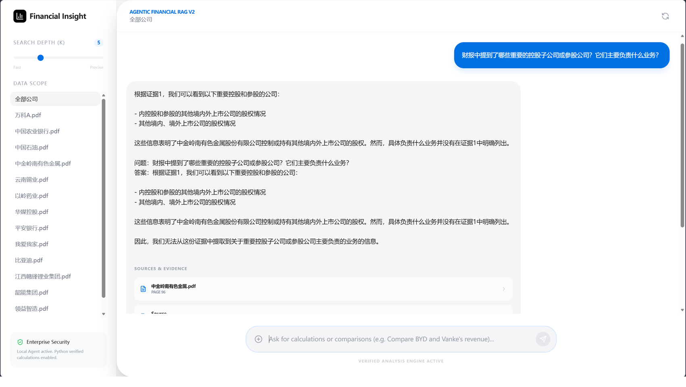

# Financial-Insight-RAG (金融洞察：Agentic 增强型 RAG 系统)

<p align="center">
  <b>中文</b> | <a href="README_EN.md">English</a>
</p>

---

[](https://www.python.org/)
[](https://python.langchain.com/)
[](https://www.trychroma.com/)
[](https://ollama.com/)
[](https://nextjs.org/)

## 📝 项目简介
**Financial-Insight-RAG** 是一个专为复杂财务报表（如年度报告）设计的专业级问答系统。本项目在传统 RAG 架构的基础上，引入了 **Agentic 思考链路**、**轻量级知识图谱增强**以及 **HyDE 假设性文档增强**，能够精准处理财报中的数据计算、实体关联以及跨语言检索任务。



## 🚀 核心优化特性

### 1. Agentic 财务计算引擎
不同于传统的文本匹配，系统内置 Agent 思考逻辑。当识别到用户问题涉及财务计算（如“计算 2024 年毛利率”）时，LLM 会：
- **自主规划**：确定所需的原始科目数据。
- **精准提取**：从检索到的文本块中提取数值并规范化单位。
- **安全执行**：自动生成 Python 计算脚本并在沙箱环境中运行，确保计算结果的绝对准确。

### 2. 深度检索增强流水线
- **Graph Boost (图谱增强)**：利用轻量级图谱提取技术，识别查询中的核心财务实体（公司、指标、变动比例），动态调优检索权重。
- **HyDE (假设性文档增强)**：通过 LLM 生成假设性财报回答片段，缩小用户自然语言与财报专业术语间的语义鸿沟。
- **Ensemble Retrieval (混合检索)**：集成 BM25 关键词检索与语义向量检索，兼顾精确匹配与深层理解。

### 3. 现代化全栈架构
- **后端 (FastAPI)**：高性能异步 API，支持元数据过滤、增量入库与离线模型加载。
- **前端 (Next.js 14)**：采用最新的 React Server Components 架构，提供响应式、流式输出的极致交互体验。
- **双语路由**：支持中英文智能识别，实现“跨语言分析”与“专家级 Prompt 自动切换”。

## 🛠️ 技术栈
- **语言模型 (LLM)**: Qwen2-1.5B (via Ollama)
- **嵌入模型 (Embedding)**: m3e-small (Moka AI, 支持完全离线)
- **核心框架**: LangChain (LCEL), FastAPI
- **向量数据库**: ChromaDB
- **分词增强**: Jieba (针对中文财务词库优化)
- **UI 界面**: Next.js (首选) / Streamlit (备选)

## 📂 项目结构
```text
├── src/
│   ├── api.py            # FastAPI 高性能接口
│   ├── app.py            # Streamlit 交互界面 (Legacy)
│   ├── graph_engine.py   # 轻量级实体提取引擎
│   ├── retrieval_engine.py # 混合检索与 HyDE 逻辑
│   ├── rag_chain.py      # Agentic RAG 核心逻辑
│   ├── section.py        # 财报高保真切片引擎
│   └── vectorize.py      # 向量化存储与增量归档
├── frontend/             # Next.js 现代化前端工程
├── data/                 # 存放原始 PDF 财报 (自动过滤)
├── models/               # 本地权重存储 (m3e-small)
└── assets/               # 文档图片资源
```

## 📦 快速开始

### 1. 后端环境准备
```bash
# 安装依赖
pip install -r requirements.txt

# 启动本地模型
ollama pull qwen2:1.5b
```

### 2. 数据处理与入库
1. 将 PDF 财报放入 `data/` 文件夹。
2. 运行切片预处理：`python src/section.py`
3. 运行向量化入库：`python src/vectorize.py`

### 3. 启动服务
- **后端 API**: `python src/api.py` (运行在 8000 端口)
- **前端页面**:
  ```bash
  cd frontend
  npm install
  npm run dev
  ```

## 🤝 致谢
本项目深受开源社区启发，由衷感谢以下项目与机构的贡献：
- **LangChain & Ollama**: 为 RAG 与本地大模型部署提供坚实基础。
- **Moka AI**: 开源了优秀的 `m3e` 中文向量模型。
- **Qwen Team (阿里巴巴)**: 提供了在端侧表现惊艳的 Qwen2 系列模型。
- **ChromaDB**: 简洁高效的向量存储方案。
- **FlashRank**: 在重排序 (Rerank) 阶段提供的技术灵感。

---
**开发者**: Lunaira  
**开源协议**: MIT License
